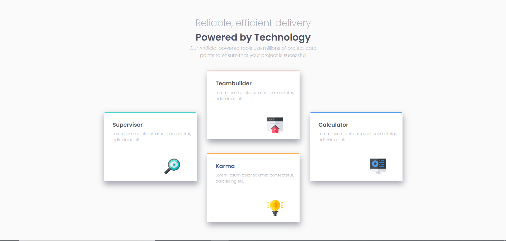

# four_cards
<h2>Ejercicio aplicando HTML, CSS grid<h2>

<h3>Interesante este proyecto ya que fue un ejercicio para practicar CSS grid y acomodar los contenedores tal vez fue lo mas retante.<h3>

<h3>les muestro el resultado final</h3>

